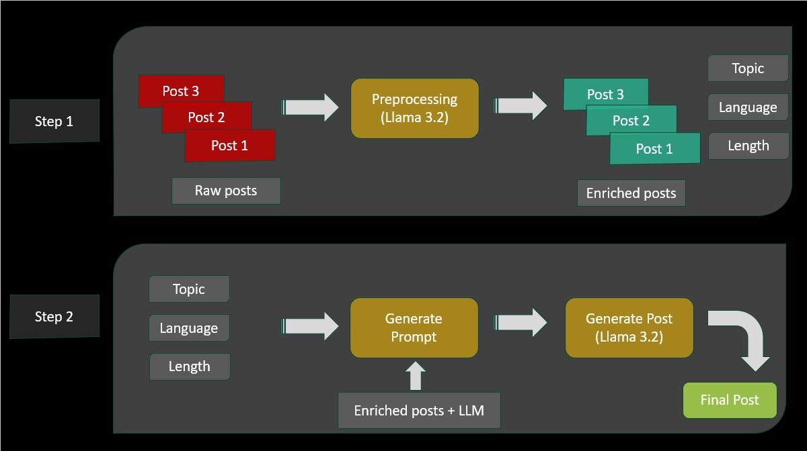
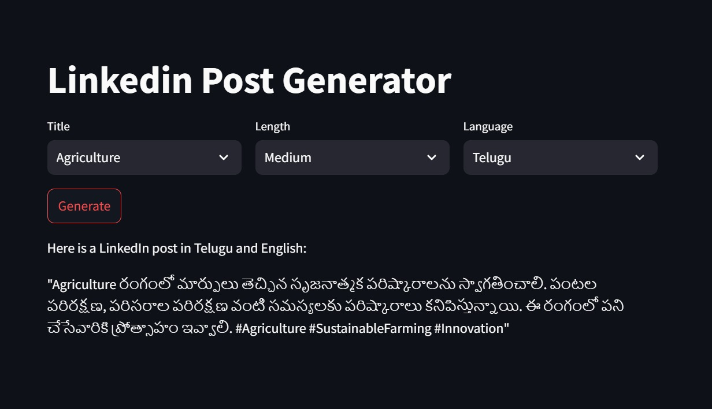

# 🚀 LinkedIn Post Generator

## 🌟 Overview

This tool is designed to analyze the LinkedIn posts of influencers and assist them in creating new posts that match their unique writing style. By feeding past LinkedIn posts into the tool, users can extract key topics and metadata. They can then select a topic, preferred language, and desired length to generate a new post, guided by the writing patterns from their past content.

---

## ✨ Features
- 🔍 **Analyze Existing Posts:** Extracts key information such as topics, language, and post length from existing LinkedIn posts.
- 📝 **Generate Tailored Posts:** Uses topics, language, and length preferences to generate new posts that align with the influencer's writing style.
- 🧠 **Few-Shot Learning:** Incorporates past posts to fine-tune the generated output for accuracy and tone consistency.
- 🖥️ **User-Friendly Interface:** An intuitive UI built with Streamlit for seamless interaction.

---

## 🛠️ Technical Architecture



### 🔹 Stage 1: Data Collection and Processing
1. 📥 Collect LinkedIn posts and preprocess the data.
2. 🔑 Extract key metadata, including:
   - 📌 Topics
   - 🌐 Language
   - 📏 Post Length
3. 💾 Store the processed data for further analysis.

### 🔹 Stage 2: Post Generation
1. ⚙️ Use user-selected parameters (topic, language, and length) to guide post generation.
2. 🧩 Leverage past posts as context for few-shot learning with an LLM (Llama 3.2).
3. ✍️ Generate a new LinkedIn post tailored to the user’s requirements.

---

## 📂 Folder Structure
Linkedin Post Generator
|-- data
|     |-- pre_process.py
|     |-- [data sets]
|-- resources
|     |-- work_flow_template.jpeg
|     |-- tool_output.jpeg
|-- [other files]

---

## ⚙️ Setup

### ✅ Prerequisites
1. 🔑 Obtain an API key:
   - Visit [GroqCloud API Keys](https://console.groq.com/keys) to create an API key.
   - Update the `.env` file with your API key:
     ```
     GROQ_API_KEY=<YOUR_API_KEY>
     ```
2. 🐍 Install Python 3.9+.

### 📦 Installation
1. 🛠️ Clone the repository:
2. 📥 Install the required dependencies:
3. ▶️ Run the Streamlit app:

---

## 🖼️ Tool Overview



### 📋 Steps to Use:
1. 📤 Upload past LinkedIn posts for analysis.
2. 🔍 Review extracted metadata (topics, language, post length).
3. 🎛️ Select the desired parameters for the new post.
4. 🖊️ Click **Generate** to create a post tailored to your style.

---

## 🛠️ Tech Stack
- **💻 Programming Language:** Python
- **🦙 LLM:** Llama 3.2
- **📊 Data Sources:** LinkedIn Post Data
- **🔧 Libraries and Tools:**
- Pandas
- JSON
- GroqCloud API
- Streamlit UI
- Generative AI

---

## 💬 Description

The LinkedIn Post Generator streamlines the process of creating engaging LinkedIn content. It empowers influencers to maintain their unique voice while saving time and effort. With advanced AI-driven analysis and generation capabilities, this tool is perfect for professionals looking to optimize their social media presence and reach a wider audience effortlessly. 🌟
